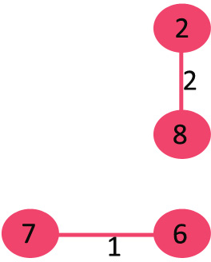
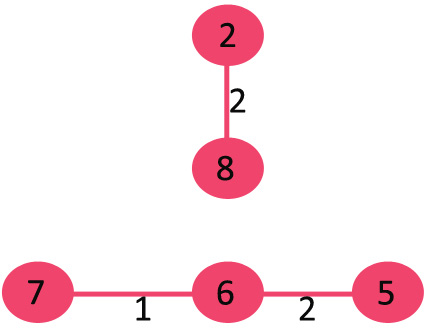
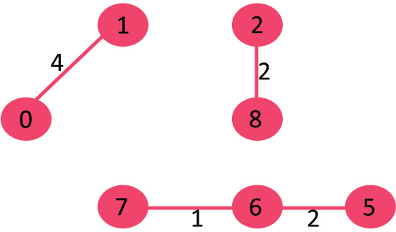
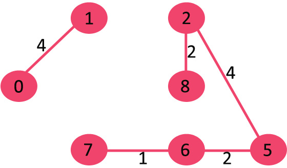
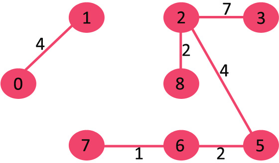
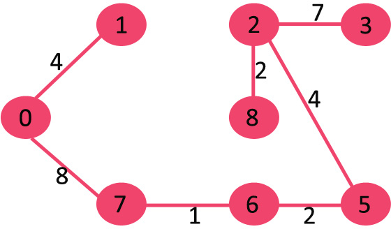

Greedy Algorithm
================
# 1. 그리디 알고리즘이란?
최적의 해를 찾는 문제를 풀어감에 있어서 각 단계마다의 최선의 선택을 통해global solution을 찾는 알고리즘이다.
각 단계에서 먼 미래를 생각하지 않고 당장 가장 이득이 되는 선택을 하기 때문에 local optimal은 만족할 수 있지만global solution은 최적의 해답이 아닐 수 있다.
순간 순간 최선의 선택이 global solution이 되기 위해서는 아래와 같은 조건을 만족해야 한다.
- 탐욕스런 선택 조건(greedy choice property)
  * 앞의 선택이 이후의 선택에 영향을 주지 않는다.
- 최적 부분 구조 조건(optimal substructure)
  * 문제에 대한 최적해가 부분문제에 대해서도 역시 최적해이다.
  (쉽게? 말해 지역적으로 최적이면 전역적으로 최적임)

###### 개인 의견) 위의 사항을 만족하는지 증명하는 부분이 굉장히 직관적이고 어려울 수 있다. 하지만 반대로 생각해서 최선의 선택이 문제의 답을 구하지 못하는 반례가 떠오르지 않는다면 구현이 쉬우니 일단 시도해 보는것이 좋지 않을까 하는 생각.

대표적으로 분할가능한 배낭(Knapsack)문제가 있는데, 기존에 Dynamic Programming으로 접근해야 풀 수 있었던 문제지만 조건에 물건을 분할 할 수 있다는 항목이 추가되면서 그리디 알고리즘으로 매우 쉽게 풀 수 있다.
물건을 가치 순서(가치/무게)로 Sort한 다음 가치가 가장 높은 물건 순으로 배낭이 꽉찰때까지 가득 채우면 된다. (마지막 물건은 배낭이 넘치지 않도록 쪼개서 일부만 들어가겠지...)

```
Tip)
그리디 알고리즘이 모든 문제에 대해 최적의 해를 찾을 순 없지만 근사 해를 찾을 수 있는 경우가 많고 모든 경우의 수를 탐색하는 DFS나 Dynamic 알고리즘에 비해
연산속도가 매우 빠르기 때문에 여러 분야에서 활용 될 수 있다.
```
---
# 2. 그리디 알고리즘 예제
## Kruskal’s Minimum Spanning Tree
최소 신장 트리 문제란, 노드(Vertex)와 가중치가 있는 간선(Edge) 으로 이루어진 Graph가 존재할 때, 가중치의 합이 가장 최소가 되는 간선만 남겨놓고 모든 노드를 연결 할 수 있는 Sub tree를 구하는 것이다.
* 입력<br/>

* 출력<br/>


해법은 그리디 알고리즘으로 접근 하면 된다.
각 간선을 가중치 오름차순으로 Sort한 후
간선을 순차적으로 순회하면서 싸이클이 생성되면 skip하고 그렇지 않으면 선택하면 된다.
1. Pick edge 7-6: No cycle is formed, include it.<br/>
  <br/>
2. Pick edge 8-2: No cycle is formed, include it.<br/>
  <br/>
3. Pick edge 6-5: No cycle is formed, include it.<br/>
  <br/>
4. Pick edge 0-1: No cycle is formed, include it.<br/>
  <br/>
5. Pick edge 2-5: No cycle is formed, include it.<br/>
  <br/>
6. Pick edge 8-6: Since including this edge results in cycle, discard it.
7. Pick edge 2-3: No cycle is formed, include it.<br/>
  <br/>
8. Pick edge 7-8: Since including this edge results in cycle, discard it.
9. Pick edge 0-7: No cycle is formed, include it.<br/>
  <br/>
10. Pick edge 1-2: Since including this edge results in cycle, discard it.
11. Pick edge 3-4: No cycle is formed, include it.<br/>
  <br/>
*최종 답의 간선 개수는 무조건 V-1개가 된다.*

여기서 문제는 싸이클이 생성되는 것을 어떻게 check할 수 있냐는 것인데.. *Union find* 알고리즘을 사용하면 된다.
어떤 원소가 어떤 그룹에 포함되어있는지를 알아내는 방법으로 배열 또는 트리를 이용해서 구현할 수 있고 아래와 같은 method를 제공한다.
- union(x, y) 합하기
  - x가 속한 집합과 y가 속한 집합을 합친다. 즉, x와 y가 속한 두 집합을 합치는 연산
- find(x) 찾기
  - x가 속한 집합의 대표값(루트 노드 값)을 반환한다. 즉, x가 어떤 집합에 속해 있는지 찾는 연산

```
1) 배열로 구현 할 경우
Array[i]: i번 원소가 속하는 집합의 번호(즉, 루트 노드의 번호)
* initialize
  - Array[i] = i와 같이 각자 다른 집합 번호로 초기화. O(N)
* union(x, y)
  - 배열의 모든 원소를 순회하면서 y의 집합 번호를 x의 집합 번호로 변경. O(N)
* find(x)
  - Array[i]를 리턴. O(1)
```
```
2) 트리로 구현할 경우
같은 집합= 하나의 트리, 즉 집합 번호 = 루트 노드
* initialize
  - 각 노드는 모두 루트 노드이므로 N개의 루트 노드 생성 및 자기 자신으로 초기화.
* union(x, y)
  -  x, y의 루트 노드를 찾고(find(x), find(y)) 다르면 y를 x의 자손으로 넣어 두 트리를 합한다. O(N)보다 작으므로 find 연산이 전체 수행 시간이 지배함.
* find(x)
  - 노드의 집합 번호는 루트 노드이므로, 루트 노드를 확인하여 같은 집합인지 확인. O(트리의 높이) 최악의 경우 O(N-1)
```

```c++
/* 초기화 */
int root[MAX_SIZE];
for (int i = 0; i < MAX_SIZE; i++)
    root[i] = i;

/* find(x): 재귀 이용 */
int find(int x) {
    // 루트 노드는 부모 노드 번호로 자기 자신을 가진다.
    if (root[x] == x) {
        return x;
    } else {
        // 각 노드의 부모 노드를 찾아 올라간다.
        return find(root[x]);
    }
}

/* union(x, y) */
void union(int x, int y){
    // 각 원소가 속한 트리의 루트 노드를 찾는다.
    x = find(x);
    y = find(y);

    root[y] = x;
}
```


*Path-compression*과 *union-by-rank*를 통한 최적화
```c++
/* 초기화 */
int root[MAX_SIZE];
int rank[MAX_SIZE]; // 트리의 높이를 저장할 배열
for (int i = 0; i < MAX_SIZE; i++) {
  root[i] = i;
  rank[i] = 0; // 트리의 높이 초기화
}

/* find(x): 재귀 이용 */
int find(int x) {
  if (root[x] == x) {
      return x;
  } else {
      // "경로 압축(Path Compression)"
      // find 하면서 만난 모든 값의 부모 노드를 root로 만든다.
      return root[x] = find(root[x]);
  }
}

/* union(x, y): union-by-rank 최적화 */
void union(int x, int y){
   x = find(x);
   y = find(y);

   // 두 값의 root가 같으면(이미 같은 트리) 합치지 않는다.
   if(x == y)
     return;

   // "union-by-rank 최적화"
   // 항상 높이가 더 낮은 트리를 높이가 높은 트리 밑에 넣는다. 즉, 높이가 더 높은 쪽을 root로 삼음
   if(rank[x] < rank[y]) {
     root[x] = y; // x의 root를 y로 변경
   } else {
     root[y] = x; // y의 root를 x로 변경

     if(rank[x] == rank[y])
       rank[x]++; // 만약 높이가 같다면 합친 후 (x의 높이 + 1)
   }
}
```

최소 신장 트리 최종 솔루션
```c++
Edge result[V]; // Tnis will store the resultant MST
int e = 0; // An index variable, used for result[]  
int i = 0; // An index variable, used for sorted edges

// Step 1: Sort all the edges in non-decreasing  
// order of their weight. If we are not allowed to  
// change the given graph, we can create a copy of  
// array of edges  
qsort(graph->edge, graph->E, sizeof(graph->edge[0]), myComp);

// Number of edges to be taken is equal to V-1  
while (e < V - 1 && i < graph->E)  
{  
    // Step 2: Pick the smallest edge. And increment  
    // the index for next iteration  
    Edge next_edge = graph->edge[i++];  

    int x = find(subsets, next_edge.src);  
    int y = find(subsets, next_edge.dest);  
  
    // If including this edge does't cause cycle,  
    // include it in result and increment the index  
    // of result for next edge  
    if (x != y)  
    {  
        result[e++] = next_edge;  
        Union(subsets, x, y);  
    }  
    // Else discard the next_edge  
}
```

Reference
1. https://www.geeksforgeeks.org/greedy-algorithms/
2. https://ko.wikipedia.org/wiki/%ED%83%90%EC%9A%95_%EC%95%8C%EA%B3%A0%EB%A6%AC%EC%A6%98
2. https://velog.io/@cyranocoding/%EB%8F%99%EC%A0%81-%EA%B3%84%ED%9A%8D%EB%B2%95Dynamic-Programming%EA%B3%BC-%ED%83%90%EC%9A%95%EB%B2%95Greedy-Algorithm-3yjyoohia5
3. https://m.blog.naver.com/PostView.nhn?blogId=ndb796&logNo=221230994142&proxyReferer=https%3A%2F%2Fwww.google.com%2F
4. https://www.geeksforgeeks.org/union-find
5. https://www.geeksforgeeks.org/union-find-algorithm-set-2-union-by-rank
6. https://gmlwjd9405.github.io/2018/08/31/algorithm-union-find.html
